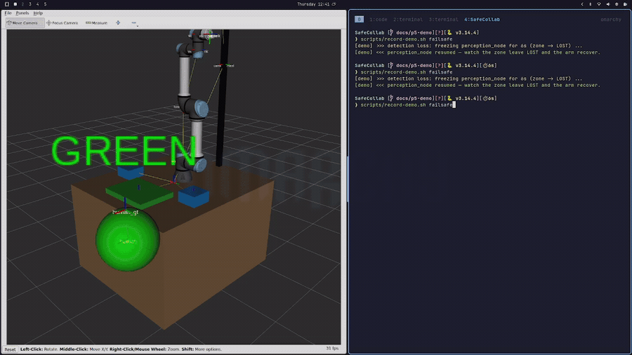
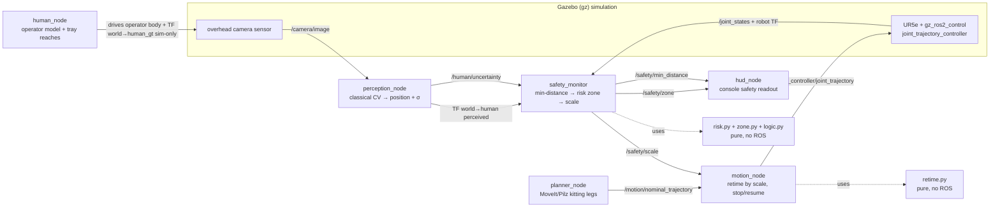

# SafeCollab

Project for the course of Smart Robotics of the Master's degree in Artificial
Intelligence Engineering.

A **ROS 2 (Jazzy) + Gazebo (Harmonic)** demonstration of an **ISO/TS 15066**
Speed-and-Separation Monitoring (SSM) safety loop: a **UR5e** runs a
MoveIt/Pilz-planned pick-and-place while a `safety_monitor` scales its speed —
**green (full) → yellow (ramp) → red (protective stop)** — from the *perceived*
distance to a human operator, and **fails safe** (`lost`) when perception is lost
or stale. Zone thresholds are **derived from an ISO/TS 15066 risk model, not
hand-tuned**.

> **Looking for the full manual?** This README is the guided tour. The exhaustive
> reference — every module, every config key, every architectural decision, and the
> full library/software inventory — lives in
> [`docs/KNOWLEDGE_BASE.md`](docs/KNOWLEDGE_BASE.md).

## Demo



One `GREEN → YELLOW → RED` protective-stop → resume cycle, then a detection-loss
fail-safe (`LOST` → re-acquire). On screen you see the UR5e running its
MoveIt/Pilz kitting motion in RViz, a coloured safety-zone sphere and label at the
operator, and a one-line console HUD:

```
SSM | RED    | speed   0% | min-dist 0.38 m
```

## Quickstart

Three self-contained demo launchers (Gazebo headless + RViz, built automatically
into a `safecollab:demo` image). Each accepts `--no-build` to reuse the image:

```bash
scripts/demo-robot.sh      # robot only — the full pick-and-place at full speed
scripts/demo-ssm.sh        # robot + operator — the ISO/TS 15066 green→yellow→red cycle
scripts/demo-failsafe.sh   # robot + operator + random detection losses (LOST fail-safe)
```

`Ctrl-C` tears any of them down cleanly. See
[Running the demos](#running-the-demos) for `scripts/record-demo.sh`, the richer
recording harness with an on-demand fail-safe cue.

---

## Architecture & data flow

A **UR5e** runs a continuous kitting loop (bin → shared tray) planned by
**MoveIt/Pilz**. A simulated overhead **camera** watches the cell; `perception_node`
detects the human operator with classical OpenCV and estimates position with an
explicit uncertainty **σ**. `safety_monitor` computes the minimum separation
between the perceived operator and the robot, maps it through a **risk-derived**
zone model to a speed **scale** (`green` 1.0 → `yellow` ramp → `red` 0.0, plus a
fail-safe `lost`), and `motion_node` — the only node that commands the arm —
**re-times** the planned trajectory by that scale. Perception drives safety;
**planning only proposes the path, safety governs its speed.**



Solid arrows are the live ROS graph; dotted arrows are in-process calls into the
pure (no-ROS) safety maths. There are **two loops**:

- **Safety loop** (closed): `perception → safety_monitor → /safety/scale →
  motion_node → arm → /joint_states → safety_monitor`. This is the SSM guarantee.
- **Task loop** (open, feeds the safety loop): `planner_node →
  /motion/nominal_trajectory → motion_node`. It only supplies a path to slow down
  or stop; it never reasons about safety.

### Nodes

- **`planner_node`** — owns the kitting cycle. Plans each leg (bin → tray) with
  MoveIt's deterministic **Pilz** PTP planner and publishes the dense
  `/motion/nominal_trajectory` plus the leg name on `/task/state`. Paces legs
  closed-loop (waits until the arm reaches each goal, so an SSM slow-down only
  *delays* a pick, never abandons it). **Never reasons about safety zones.**
- **`human_node`** — drives the simulated operator along a (randomisable) path with
  tray reaches, moving the operator body in gz via `/world/empty/set_pose` and
  broadcasting ground truth as TF `world → human_gt`. That ground truth is
  **sim-internal only** — the safety loop never consumes it (it must earn its
  distance from perception).
- **`perception_node`** — classical CV over `/camera/image`: detect the operator,
  back-project the centroid to a world point, broadcast the **perceived** TF
  `world → human`, and publish the position uncertainty σ on `/human/uncertainty`.
  On loss/stale detection it **stops broadcasting**, which the monitor treats as
  `lost`.
- **`safety_monitor`** — the heart of the SSM loop. At 20 Hz it computes the minimum
  distance between the perceived operator and the robot frames (`tool0`,
  `wrist_3_link`, `forearm_link`), feeds it and the live σ (as `z_d`) through the
  risk model to get the zone thresholds, and publishes `/safety/scale`,
  `/safety/zone`, `/safety/min_distance`, and the RViz marker. **Fail-safe:** no
  fresh perception → `lost`, scale `0.0`, and the last known position is never
  reused.
- **`motion_node`** — the **only** node that commands the arm. Fuses the nominal
  trajectory with `/safety/scale` and **re-times** each point's `time_from_start`
  (the speed knob), honours a protective stop at `scale == 0.0`, and resumes cleanly
  from the current joint state without a splice jerk.
- **`hud_node`** — a view-only console HUD subscribing `/safety/zone`,
  `/safety/scale`, and `/safety/min_distance`; renders one aligned, colour-coded
  line for the 5-second legibility check.

### Pure-logic modules (no ROS — the TDD core)

Every safety-relevant decision lives in a pure Python module with **no `rclpy`
import**, so it is unit-tested directly and counted against the ≥ 90 % coverage
gate. The ROS nodes above are thin adapters marked `# pragma: no cover`.

| Module | Responsibility |
|---|---|
| `safety/risk.py` | ISO/TS 15066 protective separation `S_p` and the `(d_red, d_yellow)` derivation from `config/risk.yaml`. |
| `safety/zone.py` | `classify(d, …)` — distance → `(zone, scale)` with the ramp formula and the `d is None → lost` fail-safe. |
| `safety/logic.py` | `SafetyMonitorLogic` — min-distance sweep over robot frames, calls `risk` + `zone`, returns zone/scale/distance/marker. |
| `safety/marker.py` | Zone → RGBA colour and RViz marker params (single source of truth for zone colour). |
| `motion/retime.py` | `retime(times, scale)` — stretch timestamps by `1/scale`; `None` at `scale == 0`. |
| `motion/logic.py` | `MotionLogic` — dead-band, active hold, and the no-backtrack resume. |
| `perception/detection.py` | `detect_human` — HSV colour-blob detector → centroid + confidence. |
| `perception/geometry.py` | pinhole intrinsics + ray→plane back-projection to a world point. |
| `perception/uncertainty.py` | `estimate_uncertainty` — depth + confidence → σ (feeds `z_d`). |
| `perception/state.py` | `PerceptionLogic` — loss-timeout state machine (`is_lost`). |
| `human/path.py`, `human/model.py` | randomised operator path (with a guaranteed tray reach) + interpolation. |
| `hud/format.py` | `format_status` — one aligned, colour-coded HUD line. |

### The speed-scaling loop, step by step

1. `perception_node` publishes the perceived operator TF `world → human` and σ.
2. `safety_monitor` computes min-distance to the robot frames; `risk.thresholds()`
   turns the live σ (`z_d`) into `(d_red, d_yellow)`; `zone.classify()` yields a
   `zone` and a `scale` in `[0, 1]`.
3. `/safety/scale` reaches `motion_node`, which re-times the current
   `/motion/nominal_trajectory` (from `planner_node`) and commands
   `/arm_controller/joint_trajectory`.
4. The controller moves the UR5e; `/joint_states` and the robot TF close the loop
   back into `safety_monitor`.
5. On lost/stale perception the monitor emits `lost` / scale `0.0` — a protective
   stop — until re-acquisition.

Because scaling lives entirely in `motion_node`, the SSM guarantee is independent
of *how* the path was produced: swapping a hand-solved arm for the MoveIt-planned
UR5e changed only the trajectory **source**, not the safety governor.

---

## Design & architecture decisions

The choices that shape the codebase, and why:

- **Clean architecture — pure logic vs. ROS adapters.** Every safety-relevant
  decision is a pure function/class with no `rclpy` import; the ROS nodes are thin
  adapters (`# pragma: no cover`) that only wire topics/TF and delegate. This keeps
  the safety maths unit-testable in a plain-Python venv (no ROS install) and lets CI
  enforce a **≥ 90 % coverage gate** on the logic without fighting the simulator.
- **Config, not constants.** Every tunable safety/risk/motion/HUD number lives in
  `config/*.yaml` and is loaded at start-up — thresholds are *computed*, never
  pasted into code. Changing the cell's safety behaviour is a YAML edit, not a code
  change.
- **Perceived distance, never dead-reckoned.** The safety loop consumes only the
  **perceived** `world → human` TF from the camera pipeline. The simulator's exact
  operator pose (`world → human_gt`) exists but is sim-internal; the monitor must
  earn its distance from perception. On loss it fails safe — the last known position
  is **never** reused to fabricate a distance.
- **Scaling lives in one place.** `motion_node` is the *only* node that commands the
  arm, and the *only* place speed is scaled. This makes the SSM guarantee
  independent of the path source and keeps "who can move the robot" auditable.
- **UR5e + MoveIt/Pilz, deterministic PTP.** The arm is a real, kinematically solved
  UR5e; motion is planned by MoveIt's **Pilz** industrial planner (deterministic
  PTP), not a sampling planner — so the demo is repeatable run-to-run and the dense
  position waypoints retime cleanly under SSM.
- **Retime, don't re-plan.** SSM scaling stretches `time_from_start` of the planned
  waypoints (`retime`) rather than replanning velocities. The controller interpolates
  the dense points, so "slow down" and "stop" work on any planned path with no
  velocity/acceleration bookkeeping.
- **Fail-safe by omission.** `perception_node` signals loss by *not broadcasting*;
  `safety_monitor` treats a missing/stale TF (older than `loss_timeout`) as `lost`.
  Safety is the default, not an extra code path that could be skipped.
- **Deploy = the container image.** There is no server or registry: CI builds the
  runnable image and, on a version tag, publishes it as a GitHub Release asset. The
  same image runs the integration/scenario suites, so "what CI tests" and "what you
  ship" are byte-identical.

---

## Safety model (ISO/TS 15066 SSM)

The zones are **derived from an ISO/TS 15066 risk model at start-up, never
hand-tuned**: the model lives in `src/safecollab/safecollab/safety/risk.py`, its
inputs in `src/safecollab/config/risk.yaml`, and the numbers below are what
`risk.thresholds()` reproduces (unit-tested in `test/unit/test_risk.py`).

### The protective-separation model

SSM keeps a **protective separation distance** `S_p` between human and robot; if the
measured separation drops below `S_p`, the robot must slow or stop. SafeCollab uses
the standard's sum of contributions:

```
S_p = S_H + S_R + S_S + C + Z_d + Z_r
```

| Term  | Meaning                                             | In SafeCollab |
|-------|-----------------------------------------------------|---------------|
| `S_H` | distance the human travels during reaction + stop   | `v_h · (t_r + t_s)` |
| `S_R` | distance the robot travels during its reaction time | `v_r · t_r` |
| `S_S` | robot stopping-distance contribution                | `s_s` |
| `C`   | intrusion distance (how far a hand reaches in)      | `c` |
| `Z_d` | operator **position uncertainty**                   | `z_d` — **live from perception (σ)** |
| `Z_r` | robot position uncertainty                           | `z_r` |

`Z_d` is the important one: it is **not** a constant — perception supplies it live as
the detection uncertainty σ, so the zones breathe with how well the camera currently
sees the operator. The plumbing is: `perception/uncertainty.estimate_uncertainty()`
→ `/human/uncertainty` → `safety_monitor` → `risk.thresholds(cfg, z_d=σ)`.

### Inputs (`config/risk.yaml`)

Shared cell/sensor properties, plus two robot scenarios that differ **only** in `v_r`
and `t_s` (a robot already moving slowly has less kinetic energy and genuinely stops
faster, so `t_s` shrinks *with* `v_r` — this is the physically correct reading of the
standard, not two independent free parameters):

| Input | Value | |
|---|---|---|
| `v_h` | 1.6 m/s | operator approach speed |
| `t_r` | 0.10 s | system reaction time |
| `s_s` | 0.06 m | robot stopping-distance contribution |
| `c`   | 0.10 m | intrusion distance |
| `z_r` | 0.02 m | robot position uncertainty |
| **full speed** | `v_r` 0.50 m/s · `t_s` 0.25 s | governs the **yellow** edge |
| **reduced**    | `v_r` 0.10 m/s · `t_s` 0.02 s | governs the **red** edge |

### Derived thresholds

`d_yellow` is `S_p` computed with the **full-speed** scenario (begin slowing);
`d_red` is `S_p` with the **reduced** scenario (must be stopped). Worked out with
`z_d = 0.05`:

```
d_yellow = 1.6·(0.10+0.25) + 0.50·0.10 + 0.06 + 0.10 + 0.05 + 0.02 = 0.84 m
d_red    = 1.6·(0.10+0.02) + 0.10·0.10 + 0.06 + 0.10 + 0.05 + 0.02 = 0.43 m
```

| `z_d` (m) | `d_red` (m) | `d_yellow` (m) |
|---|---|---|
| **0.05** (nominal) | **0.43** | **0.84** |
| 0.10 (noisier detection) | 0.48 | 0.89 |

**Property:** raising `z_d` **widens both thresholds** — a less certain operator
position makes the cell more cautious, exactly as SSM intends. This monotonicity is
asserted in `test_risk.py`.

### From distance to speed scale

`zone.classify(d, d_red, d_yellow, s_min)` maps the live minimum separation `d` to a
zone and a speed `scale ∈ [0, 1]`:

| Condition | Zone | Scale |
|---|---|---|
| `d is None` (perception lost/stale) | `lost` | `0.0` — fail-safe |
| `d ≥ d_yellow` | `green` | `1.0` — full speed |
| `d_red < d < d_yellow` | `yellow` | ramps `s_min … 1.0` linearly |
| `d ≤ d_red` | `red` | `0.0` — protective stop |

The yellow ramp is `scale = s_min + (1 − s_min)·(d − d_red)/(d_yellow − d_red)`, with
`s_min = 0.10` (config/safety.yaml) — the floor keeps the arm creeping rather than
stalling inside the band. The **yellow edge is exclusive** (`d == d_yellow → green`)
and the **red edge inclusive** (`d == d_red → red`). A `lost` or `red` scale of `0.0`
is a protective stop, and the last known operator position is **never** reused to
fabricate a distance.

---

## Perception pipeline

The perceived `world → human` TF is produced by a four-stage classical-CV pipeline,
each stage a pure module the ROS node merely orchestrates:

1. **Detect** (`detection.detect_human`) — BGR → HSV → threshold the operator's
   yellow band (hue 20–40) → largest contour → centroid `(u, v)`, area, and a
   `confidence` = blob area relative to the expected operator size.
2. **Back-project** (`geometry.project_pixel_to_plane`) — form a pinhole ray from
   `(u, v)`, rotate it into the world with the calibrated camera→world transform
   (derived from the `cell.xacro` mast chain), and intersect it with the operator
   plane `z = 0.95 m`. The operator is a **flat marker held at exactly that height**,
   so the recovered `(x, y)` is parallax-free.
3. **Estimate σ** (`uncertainty.estimate_uncertainty`) — `σ = base + depth·k_d +
   (1−confidence)·k_n`, so σ grows with range and as detection quality falls. This σ
   becomes the live `z_d` in the risk model.
4. **Track loss** (`state.PerceptionLogic`) — enforce a `loss_timeout`; while lost,
   the node stops broadcasting, which the monitor reads as `lost` (fail-safe).

`scripts/validate-perceived.sh` proves this live: it compares perceived `world→human`
against ground-truth `world→human_gt` (must agree within 0.15 m) and checks that the
SSM loop reacts as the operator approaches.

---

## Interface contract (topics & QoS)

The node interface was frozen first (AGENTS.md §3) so streams could be built in
parallel against it. QoS is matched per topic by `_ros_runtime` (`reliable_qos`,
`transient_qos`, `best_effort_qos`):

| Topic / channel | Type | QoS | Producer → Consumer |
|---|---|---|---|
| `/camera/image` | `sensor_msgs/Image` | best-effort | gz camera → `perception_node` |
| TF `world → human_gt` | `tf2` | — | `human_node` → (sim-internal only) |
| TF `world → human` | `tf2` | — | `perception_node` → `safety_monitor` (**perceived**) |
| `/human/uncertainty` | `std_msgs/Float32` (σ, m) | reliable | `perception_node` → `safety_monitor` |
| `/safety/scale` | `std_msgs/Float32` (0–1) | reliable | `safety_monitor` → `motion_node` |
| `/safety/zone` | `std_msgs/String` | reliable, transient_local | `safety_monitor` → HUD/viz |
| `/safety/min_distance` | `std_msgs/Float32` (m) | best-effort | `safety_monitor` → HUD/viz |
| `/viz/safety_marker` | `visualization_msgs/Marker` | best-effort | `safety_monitor` → RViz |
| `/motion/nominal_trajectory` | `trajectory_msgs/JointTrajectory` | reliable | `planner_node` → `motion_node` |
| `/task/state` | `std_msgs/String` | reliable, transient_local | `planner_node` → HUD/viz |
| `/arm_controller/joint_trajectory` | `trajectory_msgs/JointTrajectory` | controller default | `motion_node` → JTC |

---

## The robot cell

- **Description** (`urdf/cell.xacro`) — the **UR5e** (`ur_description` macro) on a
  table, two feeder bins, a shared kitting tray, and an overhead camera on a mast,
  all as fixed links so they double as MoveIt collision geometry. `gz_ros2_control`
  wires the six UR joints into Gazebo.
- **World** (`worlds/cell.sdf`) — `empty.sdf` plus the gz **Sensors** system so the
  camera actually renders (headless uses EGL offscreen rendering).
- **Operator** (`urdf/operator.sdf`) — a flat yellow marker `human_node` moves via
  `/world/empty/set_pose`; perception detects it by colour.
- **Controllers** (`config/controllers.yaml`) — `joint_state_broadcaster` +
  `arm_controller` (a `joint_trajectory_controller` over the six UR joints).
- **MoveIt** (`srdf/cell.srdf.xacro`, `config/kinematics.yaml`,
  `config/joint_limits.yaml`, `config/pilz_cartesian_limits.yaml`) — the semantic
  model + Pilz pipeline `planner_node` loads via `MoveItConfigsBuilder`.

The launch file `launch/cell.launch.py` assembles all of this and exposes flags to
scope what runs (see below).

---

## Running the demos

### The three focused launchers

| Script | Shows | Under the hood |
|---|---|---|
| `scripts/demo-robot.sh` | UR5e running the **full pick-and-place at full speed**, no operator | `human:=false safety:=false` — arm runs at scale 1.0; foreground streams the leg names |
| `scripts/demo-ssm.sh` | The **ISO/TS 15066** cycle: operator approaches → green→yellow→**red stop**→resume | full cell, `path_seed:=42`; foreground is the console HUD |
| `scripts/demo-failsafe.sh` | SSM **plus detection losses at random times** → `LOST` fail-safe → recover | full cell + a background failsafe loop; foreground HUD |

All three run Gazebo headless + RViz, take `--no-build` to reuse the image, and tear
down cleanly on `Ctrl-C`.

### `record-demo.sh` — the recording harness

`scripts/record-demo.sh` brings up Gazebo + RViz + the HUD, driven by the *perceived*
operator, with an on-demand fail-safe cue:

```bash
scripts/record-demo.sh                      # build (if needed) + bring it all up
scripts/record-demo.sh failsafe             # (2nd terminal) freeze perception ~6 s → LOST → resume
scripts/record-demo.sh failsafe --hold 8    # hold the loss longer
scripts/record-demo.sh down                 # tear everything down
```

A good ~30-second take covers the acceptance story: **approach** (`GREEN → YELLOW →
RED`, speed → `0%`), **retreat** (arm resumes, back to `GREEN`), then the **fail-safe**
cue (grey `LOST` → re-acquire).

| Flag | Effect |
|------|--------|
| `--no-build` | reuse the existing `safecollab:dev` image |
| `--source ground_truth` | drive from ground-truth TF if perception is GPU-flaky |
| `--seed N` | a different deterministic operator path (default `42`) |
| `--no-rviz` | HUD only (no RViz window; gz stays headless) |
| `--gz-gui` | also open the raw Gazebo window (needs good GL passthrough) |
| `--auto-failsafe` | fire the loss→recover cue automatically (~35 s in) |

### Launch flags (`cell.launch.py`)

| Flag | Default | Effect |
|---|---|---|
| `headless` | `false` | gz server-only, offscreen rendering (CI/Docker/no-display) |
| `rviz` | `false` | open RViz with `config/view.rviz` |
| `hud` | `false` | run the console HUD node |
| `human` | `true` | spawn the operator body + `human_node` |
| `safety` | `true` | run `perception_node` + `safety_monitor` (SSM loop) |
| `safety_source` | `perceived` | which human TF the loop reads (`perceived` \| `ground_truth`) |
| `path_seed` | `0` | operator-path RNG seed (`0` = non-deterministic; `>0` = reproducible) |

---

## Robustness guarantees

Four guarantees harden the SSM loop under adverse conditions, each verified at the
layer where it is cheapest and most deterministic — a pure-logic property as a unit
test, an emergent behaviour as a live scenario:

| # | Guarantee | Layer | Test |
|---|-----------|-------|------|
| AT-6 | Behaviour generalises across randomised operator paths (no path-specific tuning) | scenario (live) | `test/scenario/test_robustness.py::test_at6_randomised_paths_generalise` |
| AT-4r | A protective stop part-way through a leg resumes without backtracking | unit | `test/unit/test_motion_node.py` |
| AT-3r | A fast operator crossing cannot skip the protective stop between ticks | unit | `test/unit/test_fast_crossing.py` |
| AT-5r | A transient detection loss fails safe, then re-acquires and resumes | scenario (live) | `test/scenario/test_robustness.py::test_recovery_after_transient_detection_loss` |

- **AT-6** — with a fixed `path_seed`, `human_node` regenerates a fresh random
  operator path each cycle, so one run is driven by several distinct paths. Using the
  same `risk.yaml` thresholds, the escalation and clean resume must recur, and the
  zone must never spuriously enter `lost`.
- **AT-4r** — `motion_node` drops the nominal waypoints the robot has already passed
  and resumes from the current state, so progress toward the goal is monotonic (no
  backtrack jerk); the goal is always retained.
- **AT-3r** — a sampling invariant: even at the maximum modelled operator speed
  (`risk.yaml` `v_h`), the displacement per safety-monitor tick (`v_h / 20 Hz`) is
  well below the width of the red band `[0, d_red]`, so a fast head-on approach cannot
  "tunnel" past the stop between two ticks. Inputs are read from the real config,
  never hard-coded.
- **AT-5r** — a transient loss must fail safe and recover: after `loss_timeout` the
  monitor passes `d=None` to `classify()`, which returns `("lost", 0.0)` — the last
  position is never reused — and on recovery the loop re-acquires and resumes with no
  node faulting.

These complement the AT-1…AT-5 acceptance harness (`test/scenario/test_at1_at5.py`),
which proves the core green→yellow→red / stop / resume / fail-safe behaviour for a
single seeded path.

---

## Testing & CI

Three test layers under `src/safecollab/test/`:

- **unit** — pure logic, run in a plain-Python venv (no `rclpy`); enforces the
  **≥ 90 % coverage gate** on the safety/risk modules.
- **integration** — headless `launch_testing` bring-up (`test_bringup.py`):
  controllers active, TF resolves, topic rates, clean exit codes.
- **scenario** — the AT-1…AT-6 acceptance tests (`test_at1_at5.py`,
  `test_robustness.py`) run **inside the deploy image**.

CI (`.github/workflows/ci.yml`) runs on pushes to `main` and PRs into `main`, in
gated stages — **lint → build → unit → integration → scenario → package** (+ a
`deliver` stage on tags). Lint is `ruff` (0.8.6) + `yamllint`. On a `vX.Y.Z` tag the
`deliver` stage publishes the image as a GitHub Release asset with the matching
changelog slice. Release history follows SemVer in [`CHANGELOG.md`](CHANGELOG.md).

---

## Software & libraries

| Area | Used |
|---|---|
| Middleware | ROS 2 **Jazzy** (`rclpy`, `tf2_ros`, launch) |
| Simulation | Gazebo **Harmonic** (`ros_gz_sim`, `ros_gz_bridge`, `ros_gz_image`) |
| Control | `ros2_control`, `gz_ros2_control`, `joint_trajectory_controller` |
| Motion planning | **MoveIt 2** (`moveit_py`) + **Pilz** industrial motion planner |
| Robot model | `ur_description`, `ur_simulation_gz`, `ur_moveit_config` (UR5e) |
| Perception | **OpenCV** (`cv2`, `cv_bridge`), **NumPy** |
| Config | **PyYAML** |
| Test / lint | `pytest`, `pytest-cov`, `launch_testing`, `ruff`, `yamllint` |
| Packaging / CI | **Docker** (multi-stage, BuildKit cache mounts), GitHub Actions |

---

## Repository layout

```
src/safecollab/
  config/    risk.yaml safety.yaml motion.yaml hud.yaml controllers.yaml
             kinematics.yaml joint_limits.yaml pilz_*.yaml view.rviz
  launch/    cell.launch.py
  urdf/      cell.xacro  operator.sdf
  srdf/      cell.srdf.xacro
  worlds/    cell.sdf
  safecollab/
    safety/       risk.py zone.py logic.py marker.py node.py config.py
    motion/       retime.py logic.py node.py config.py
    perception/   detection.py geometry.py uncertainty.py state.py node.py
    planning/     plan.py node.py
    human/        path.py model.py node.py
    hud/          format.py node.py
    _ros_runtime.py     # shared QoS / config-path / spin-and-shutdown glue
  test/    unit/  integration/  scenario/
scripts/   demo-robot.sh demo-ssm.sh demo-failsafe.sh record-demo.sh
           validate-perceived.sh demo-common.sh
Dockerfile  entrypoint.sh  .github/workflows/ci.yml
AGENTS.md   CHANGELOG.md   docs/KNOWLEDGE_BASE.md
```

For the full per-module, per-config, and per-decision reference, see
[`docs/KNOWLEDGE_BASE.md`](docs/KNOWLEDGE_BASE.md).
