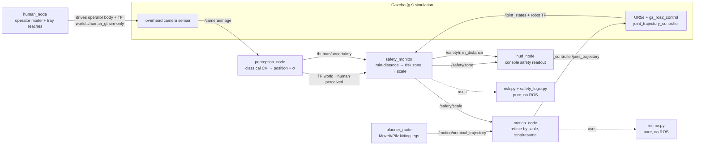

# SafeCollab — Architecture & Data Flow

How the pieces fit together and how the **ISO/TS 15066 Speed-and-Separation
Monitoring (SSM)** loop governs the robot. The authoritative interface contract
(topics, types, QoS) is [`AGENTS.md §3`](../AGENTS.md); this document is the
picture and the walk-through. The safety maths behind the zones is in
[`RISK.md`](RISK.md); the recorded behaviour is in [`DEMO.md`](DEMO.md).

## One paragraph

A **UR5e** runs a continuous kitting loop (bin → shared tray) planned by
**MoveIt/Pilz**. A simulated overhead **camera** watches the cell; a **perception
node** detects the human operator with classical OpenCV and estimates position
with an explicit uncertainty **σ**. A **safety monitor** computes the minimum
separation between the perceived operator and the robot, maps it through a
**risk-derived** zone model to a speed **scale** (`green` 1.0 → `yellow` ramp →
`red` 0.0, plus a fail-safe `lost`), and the **motion node** — the only node that
commands the arm — **re-times** the planned trajectory by that scale. Perception
drives safety; **planning only proposes the path, safety governs its speed.**

## Data flow

Solid arrows are the live ROS graph; dotted arrows are in-process function calls
into the pure (no-ROS) safety maths. The **safety loop** is the closed cycle
`perception → safety_monitor → /safety/scale → motion_node → arm → /joint_states →
safety_monitor`; the **task loop** (`planner_node → /motion/nominal_trajectory →
motion_node`) only feeds it a path to slow down or stop.

## Nodes

- **`planner_node`** — owns the kitting cycle. Plans each leg (bin → tray) with
  MoveIt's deterministic Pilz PTP/LIN planner and publishes the dense
  `/motion/nominal_trajectory`. Paces legs closed-loop (waits until the arm
  reaches each goal). **Never reasons about safety zones.** (Replaced the retired
  hand-solved `task_node`.)
- **`human_node`** — drives the simulated operator along a (randomisable) path
  with tray reaches, moving the operator body in gz and broadcasting ground truth
  as TF `world → human_gt`. That ground truth is **sim-internal only** — the
  safety loop never consumes it (it must earn its distance from perception).
- **`perception_node`** — classical CV over `/camera/image`: detect the operator,
  back-project the centroid to a world point, broadcast the **perceived** TF
  `world → human`, and publish the position uncertainty on `/human/uncertainty`
  (σ). On loss/stale detection it stops publishing, which the monitor treats as
  `lost`.
- **`safety_monitor`** — the heart of the SSM loop. Computes the minimum distance
  between the perceived operator and the robot frames (`tool0`, `wrist_3_link`,
  `forearm_link`), feeds it and the live σ (as `z_d`) through the risk model to
  get the zone thresholds, and publishes `/safety/scale`, `/safety/zone`,
  `/safety/min_distance`, and the RViz marker. **Fail-safe:** no fresh perception
  → `lost`, scale `0.0`, and the last known position is never reused.
- **`motion_node`** — the **only** node that commands the arm. Fuses the nominal
  trajectory with `/safety/scale` and **re-times** each point's `time_from_start`
  (the speed knob), honours a protective stop at `scale == 0.0`, and resumes
  cleanly from the current joint state without a splice jerk.
- **`hud_node`** — a view-only console HUD subscribing `/safety/zone`,
  `/safety/scale`, and `/safety/min_distance`; renders one aligned, colour-coded
  line for the 5-second legibility check.

## Pure logic modules (no ROS — the TDD core, §2.1/§9)

- **`risk.py`** — the ISO/TS 15066 protective-separation model `S_p` and the
  zone-threshold derivation from `config/risk.yaml`. See [`RISK.md`](RISK.md).
- **`safety_logic.py`** — `classify(d, …)` maps a distance to `(zone, scale)`
  with the ramp formula and the `d is None → lost` fail-safe.
- **`retime.py`** — stretches trajectory timestamps by `1/scale`; the maths
  `motion_node` applies to turn a scale into a slower/stopped motion.

## The speed-scaling loop, step by step

1. `perception_node` publishes the perceived operator TF `world → human` and σ.
2. `safety_monitor` computes min-distance to the robot frames; `risk.py` turns the
   live σ (`z_d`) into `(d_red, d_yellow)`; `safety_logic.classify()` yields a
   `zone` and a `scale` in `[0, 1]`.
3. `/safety/scale` reaches `motion_node`, which re-times the current
   `/motion/nominal_trajectory` (from `planner_node`) and commands
   `/arm_controller/joint_trajectory`.
4. The controller moves the UR5e; `/joint_states` and the robot TF close the loop
   back into `safety_monitor`.
5. On lost/stale perception the monitor emits `lost` / scale `0.0` — a protective
   stop — until re-acquisition.

Because scaling lives entirely in `motion_node`, the SSM guarantee is independent
of *how* the path was produced: swapping the hand-solved arm for the MoveIt-planned
UR5e (v0.5.0) changed only the trajectory **source**, not the safety governor.
